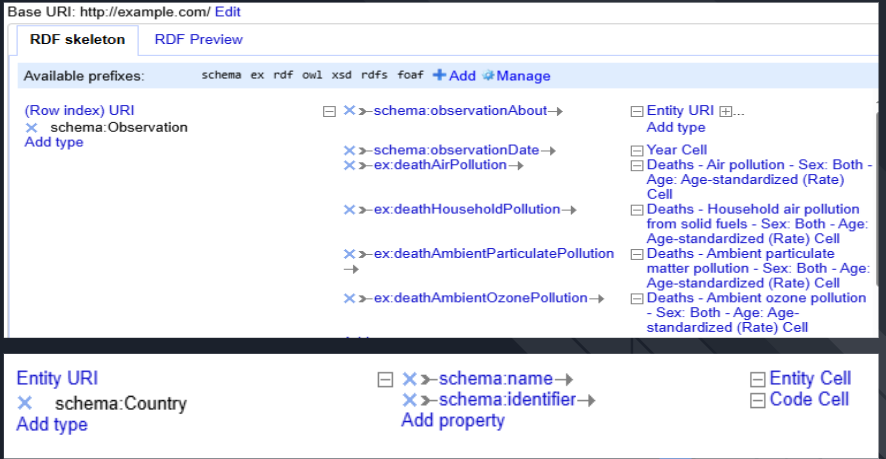

# projet_web_semantique
L’objectif du projet est de transformer les données ouvertes sur la pollution en données sémantiques et de  lier ses données sémantiques au cloud.

## Endpoint  de notre projet


## Structure

- `data/` : fichiers RDF/TTL
- `queries/` : requêtes SPARQL
- `scripts/` : scripts d'import/export ou automation
- `images/` : images de la construction de squelette sous OPENREFINE


# Etapes du projet

## Données

Les données de [pollution](https://www.kaggle.com/datasets/pavan9065/air-pollution) utilisées renseignent sur les nombres de décès due à la pollution dans divers  pays du monde. Vous pouvez y accéder via la table [death-rates-from-air-pollution.csv](data/death-rates-from-air-pollution.csv)

## Transformation des données

### OpenRefine + RDF

La transformation de la table de pollution de format csv en fichier RDF (.ttl) s'est fait avec OpenRefine pour le chargement des données et RDF (intégré à OpenRefine) pour la définition du
squelette du fichier RDF (voir [pollution.ttl](data/pollution.ttl))



## Rêquetes SPARQL

1. Lancer Fuseki :
```bash
fuseki-server --file=data/pollution.ttl /dataset
```

### Nombre moyen de décès selon le type de pollution

```sh
PREFIX schema: <http://schema.org/>
PREFIX ex: <http://example.com/>

SELECT
  ?country_name
  (AVG(?air) AS ?avgAir)
  (AVG(?house) AS ?avgHouse)
  (AVG(?particulate) AS ?avgParticulate)
  (AVG(?ozone) AS ?avgOzone)
  
WHERE {

  ?obs a schema:Observation ;
       schema:observationAbout ?country ;
       ex:deathAirPollution ?air ;
       ex:deathHouseholdPollution ?house ;
       ex:deathAmbientParticulatePollution ?particulate ;
       ex:deathAmbientOzonePollution ?ozone .
       ?country schema:name ?country_name

}GROUP BY ?country_name ORDER BY ?country_name
```

### Pays avec moin de décès entre 1999 et 2002

```sh
PREFIX schema: <http://schema.org/>
PREFIX ex: <http://example.com/>
PREFIX xsd: <http://www.w3.org/2001/XMLSchema#>

SELECT ?year ?country_name (ROUND(?deathAirPollution) as ?deaths)
WHERE {
  # Sous-requête pour obtenir le minimum d'air par année
  {
    SELECT ?year (MIN(?deathAirPollution) AS ?minAir)
    WHERE {
      ?obs a schema:Observation ;
           schema:observationAbout ?country ;
           schema:observationDate ?year ;
           ex:deathAirPollution ?deathAirPollution .
    }
    GROUP BY ?year
  }
?obs a schema:Observation ;
       schema:observationAbout ?country ;
       schema:observationDate ?year ;
       ex:deathAirPollution ?deathAirPollution .
  ?country schema:name ?country_name .

  # Filtrer pour ne garder que la valeur maximale
  FILTER(?deathAirPollution = ?minAir)
  FILTER(?year >= "1999"^^xsd:gYear && ?year < "2003"^^xsd:gYear )
}
ORDER BY ?year
```
## Rêquetes Fédérées SPARQL

### Nombre de joueurs parmis les plus chers de 2021 provenant des pays 
```sh
PREFIX schema: <http://schema.org/>
PREFIX ex: <http://example.com/>
PREFIX dbo: <http://dbpedia.org/ontology/>

SELECT ?countryName
       (MAX(?deathAir) AS ?maxDeathAir)
       (MAX(?deathHousehold) AS ?maxDeathHousehold)
       (MAX(?deathAmbientParticulatePollution) AS ?maxDeathParticulate)
       (MAX(?deathAmbientOzonePollution) AS ?maxDeathOzone)
       (COUNT(DISTINCT ?player) AS ?nbPlayers)
WHERE {
  GRAPH <http://example.com/graph/pollution> {
    ?country a schema:Country ;
             schema:name ?countryName .
    ?obs a schema:Observation ;
         schema:observationAbout ?country ;
         schema:observationDate ?year ;
         ex:deathAirPollution ?deathAir ;
         ex:deathHouseholdPollution ?deathHousehold ;
         ex:deathAmbientParticulatePollution ?deathAmbientParticulatePollution ;
         ex:deathAmbientOzonePollution ?deathAmbientOzonePollution .
  }
  
  GRAPH <http://example.com/graph/players> {
    ?player dbo:nationality ?country .
  }
}
GROUP BY ?countryName
ORDER BY DESC(?maxDeathAir)
LIMIT 20

```
### Nombre total de morts due à la pollution de l'air par continent, et le nombre de joueurs chers de 2021 par continent 
```sh
PREFIX schema: <http://schema.org/>
PREFIX ex: <http://example.com/>
PREFIX dbo: <http://dbpedia.org/ontology/>
PREFIX rdf: <http://www.w3.org/1999/02/22-rdf-syntax-ns#>
PREFIX rdfs: <http://www.w3.org/2000/01/rdf-schema#>

SELECT ?continent 
	(SUM(?deathAir) AS ?totalDeaths) 
	(COUNT(DISTINCT ?player) AS ?numPlayers)
WHERE {
  GRAPH <http://example.com/graph/pollution> {
    ?country a schema:Country ;
             schema:name ?countryName .
    ?obs a schema:Observation ;
         schema:observationAbout ?country ;
         schema:observationDate ?year ;
         ex:deathAirPollution ?deathAir ;
         ex:deathHouseholdPollution ?deathHousehold ;
         ex:deathAmbientParticulatePollution ?deathAmbientParticulatePollution ;
         ex:deathAmbientOzonePollution ?deathAmbientOzonePollution .
  }
  
  GRAPH <http://example.com/graph/players> {
    OPTIONAL{
    	?player dbo:nationality ?country .
    }
  }
      GRAPH <http://example.com/graph/population> {
      ?x rdf:type dbo:Country ;
         dbo:countryRank ?countryRank;
         dbo:isoCode ?code;
         rdfs:label ?countryName;
         dbo:capital ?capital;
         dbo:continent ?continent;
         dbo:populationTotal ?pop22;
         ex:population2010 ?pop10;
    }
} GROUP BY ?continent 
```
